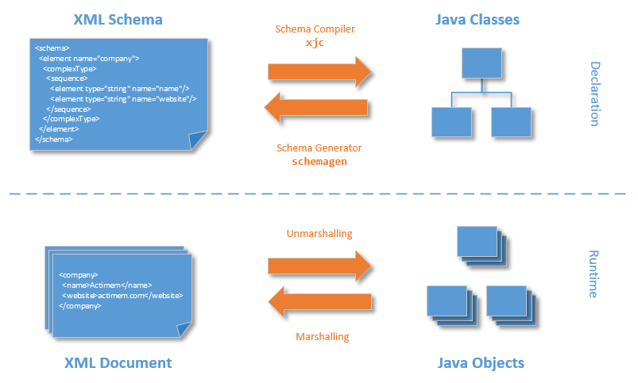

#### JAXB 


* XML
```
<?xml version="1.0" encoding="UTF-8" standalone="yes"?>
<user>
<name>Naresh</name>
<email>naresh@gmail.com</name>
<password>pass123</password>
</user>
```

#### User class annotated with JAXB annotations
```
@XmlAccessorType(XmlAccessType.FIELD)
@XmlType(name = "user", propOrder = {
    "id",
    "name",
    "email",
    "password"
})
public class User {

    protected int id;
    @XmlElement(required = true)
    protected String name;
    @XmlElement(required = true)
    protected String email;
    @XmlElement(required = true)
    protected String password;
    ...
}
```

#### Testing
```

		User user = new User();
		user.setId(1);
		user.setName("naresh");
		user.setEmail("naresh@gmail.com");
		user.setPassword("pass123");

		try {

			JAXBContext jaxbContext = JAXBContext.newInstance(User.class);
			Marshaller jaxbMarshaller = jaxbContext.createMarshaller();

			// output pretty printed
			jaxbMarshaller.setProperty(Marshaller.JAXB_FORMATTED_OUTPUT, true);

			jaxbMarshaller.marshal(user, System.out);

		} catch (JAXBException e) {
			e.printStackTrace();
		}
```
